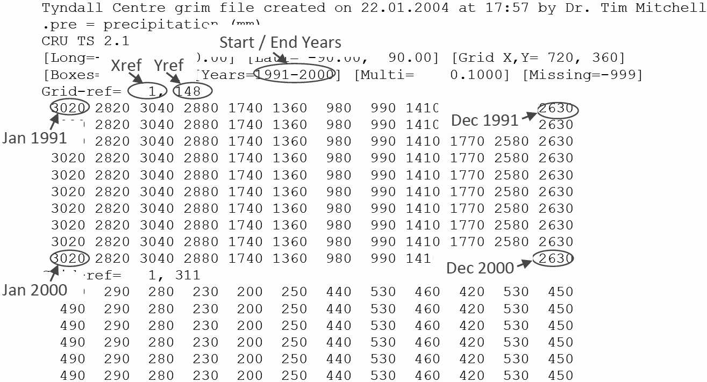

# Code Challenge JBA

At JBA we regularly receive varied datasets from our clients. To work with them efficiently, we often have to transform them into something which we can use more readily. We want to see your development skills in data manipulation.

The example data contains precipitation (rainfall) data that we would like in a database table with the following structure.

| Xref	| Yref | Date | Value |
|------|------|-----|-----|
| 1	| 148 | 1/1/1991 | 3020 |
| 1 | 148 | 2/1/1991 | 2820 |

To help you understand the data, an excerpt is shown below with notes on its structure.

The code that you write should have an option to specify the file name, read in the header data, transform the data, create the database table structure and insert the information into the database.

You are free to use any programming language and database technology that you choose. For junior developers we're looking to see what you can do; for senior developers we want to see evidence of your coding standards.

